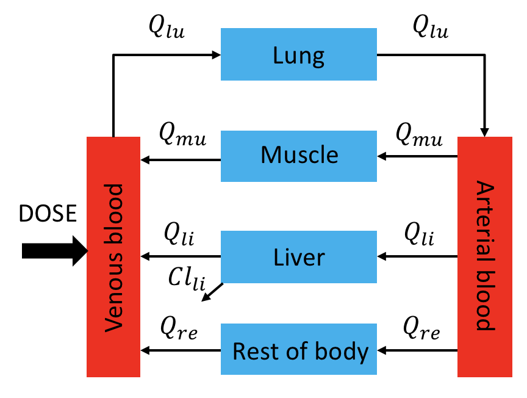
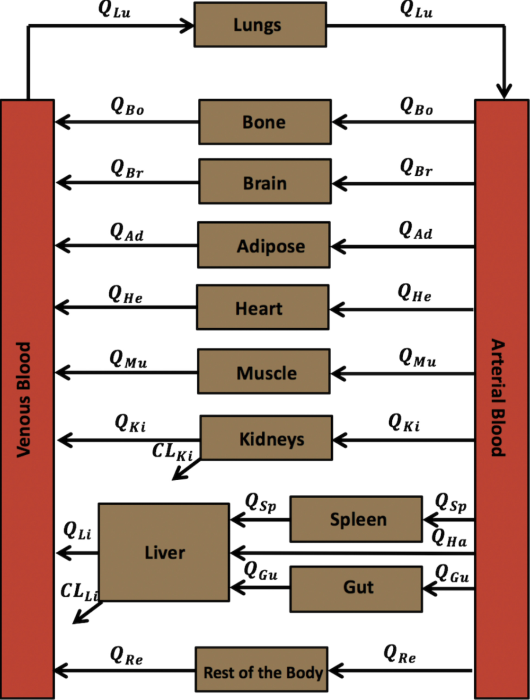
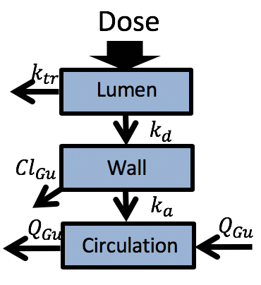

```{r, echo=F}
# set chunk options
knitr::opts_chunk$set(message = F, warning = F, echo = F)
```

---

# Why Open-Source?

## A Little Story..

<font face = "Brush Script MT" size =" 5">Once upon a time, there was a young, naive and yet brilliant, scientist, who had a thought..

{width=50%}

..the young scientist then came across an intriguing paper about the discrepancy in the PK of an antifungal drug, called voriconazole, when administered to adults versus children</font> https://link.springer.com/article/10.1007%2Fs40262-014-0181-y.

**What Open-Source Offers:**

- Free accessibility
- Easy communication
- Transparency
- Reproducibility

Example of open-source PBPK modeling and simulation software is PK-Sim/MoBi http://www.open-systems-pharmacology.org/

---

# Why R?

- Open-source
- Flexible
- Ecosystem
    - Data manipulation
    - Plotting
    - Sensitivity analysis
    - Parameter estimation
    - Version control
    - Dynamic/interactive presentations https://shiny.rstudio.com/gallery/
    - Cloud computing

{width=75%}

- Fun!

---

# Let's Start Coding..


## PBPK Modeling and Simulation

### mrgsolve

Elmokadem, Ahmed, Matthew M. Riggs, and Kyle T. Baron. 2019. “Quantitative Systems Pharmacology and Physiologically-Based Pharmacokinetic Modeling With Mrgsolve: A Hands-On Tutorial.” CPT: Pharmacometrics & Systems Pharmacology, October. https://doi.org/10.1002/psp4.12467.

```{r}

# load libraries
library(tidyverse)
library(mrgsolve)
library(FME)
library(sensitivity)
library(nloptr)

```

### Simple PBPK Model

#### Model structure

{width=50%}

#### Equations

* Non-eliminating compartment (Muscle)

$$\frac{dA_{mu}}{dt}=Q_{mu}(C_{art}-\frac{C_{mu}}{\frac{Kp_{mu}}{BP}})$$ 

* Eliminating compartment (Liver):

$$\frac{dA_{li}}{dt}=Q_{li}(C_{art}-\frac{C_{li}}{\frac{Kp_{li}}{BP}})-Cl_{li}.f_{u}.\frac{C_{li}}{\frac{Kp_{li}}{BP}}$$

* Arterial blood compartment:

$$\frac{dA_{art}}{dt}=Q_{lu}(\frac{C_{lu}}{\frac{Kp_{lu}}{BP}}-C_{art})$$
    
* Venous blood compartment:

$$\frac{dA_{ven}}{dt}=\sum_{T\neq lu} (Q_T.\frac{C_T}{\frac{Kp_T}{BP}}) − Q_{lu}.C_{ven}$$
    
* Lungs:

$$\frac{dA_{lu}}{dt}=Q_{lu}(C_{ven} − \frac{C_{lu}}{\frac{Kp_{lu}}{BP}})$$

#### Tasks

1. Use `../model/simplePBPK.cpp` file to build a simple PBPK model.

2. Use `script.R` script to compile the model and run a simple simulation (chunks 1 and 2).

---

### Voriconazole PBPK Model 

#### References
Zane NR, Thakker DR. A physiologically based pharmacokinetic model for voriconazole disposition predicts intestinal first-pass metabolism in children. Clin Pharmacokinet. 2014;53: 1171–1182 <br> https://link.springer.com/article/10.1007%2Fs40262-014-0181-y

ICRP Publication 89 http://www.icrp.org/publication.asp?id=ICRP%20Publication%2089

Utsey, Kiersten, Madeleine S. Gastonguay, Sean Russell, Reed Freling, Matthew M. Riggs, and Ahmed Elmokadem. 2020. “Quantification of the Impact of Partition Coefficient Prediction Methods on PBPK Model Output Using a Standardized Tissue Composition.” Drug Metabolism and Disposition: The Biological Fate of Chemicals, July. https://doi.org/10.1124/dmd.120.090498.

#### Model structure

{width=50%}


#### Tasks

**Note:** for the following tasks use `script.R` chunks 3-?.

1. Explore and compile typical adult male PBPK model `../model/voriPBPK.cpp` 

```{r}

modA <- mread("../model/voriPBPK")

```

2. Use `calcKp_PT.R` function to calculate voriconzole tissue:plasma partition coefficients according to Poulin and Theil method https://www.ncbi.nlm.nih.gov/pubmed/11782904.

```{r}

source("CalcKp_P&T.R")

#voriconazole physicochemical properties
logP <- 2.56  #lipophilicity
pKa <- 1.76  
fup <- 0.42   #unbound fraction in plasma
type <- 3     #monoprotic base
BP <- 1       #blood:plasma concentration ratio
dat <- read.csv("../data/source/tissue_comp_P&T.csv")

#calculate partition coefficients
Kp <- calcKp_PT(logP=logP, pKa=pKa, fup=fup, BP=BP, type=type, dat=dat)

#update model parameters partition coefficients
modA <- param(modA, Kp)

```

3. Simulate the steady state after a 4 mg/kg IV infusion dose of voriconazole given to an 
adult male with a rate of 4 mg/kg/h twice a day for 7 days. Compare the steady state plasma drug concentration-time profiles from previous simulation to the observed data in 
`Adult_IV.csv`.
(N.B.: observed data were digitized from Zane and Thakker (2014) paper using WebPlotDigitizer https://automeris.io/WebPlotDigitizer/):

```{r}

#load observed IV infusion data
obs <- read.csv("../data/source/Adult_IV.csv")

#set simulation conditions
bw   <- 73
amt  <- 4*bw
rate <- 4*bw
cmt  <- "VEN"
ii   <- 12
addl <- 13
ss   <- 1

#run simulation
sim <- 
  modA %>% 
  ev(amt=amt, cmt=cmt, ii=ii, addl=addl, rate=rate, ss=ss) %>% 
  mrgsim(delta = 0.1, end = 12) %>% 
  filter(row_number() != 1)  

#plot prediction and compare to observed data
gp <- ggplot() + 
  geom_point(data = obs, aes(x=time, y=obs, col="observed"), size=2.5) + 
  geom_errorbar(data = obs, aes(x = time, y = obs, ymin=obs-sd, ymax=obs+sd), width=0) +
  geom_line(data = sim, aes(x=time, y=CP, col="sim"), lwd=1) + 
  scale_colour_manual(name='', 
                      values=c('sim'='black', 'observed'='black'), 
                      breaks=c("observed","sim"),
                      labels=c("observed","predicted")) +
  guides(colour = guide_legend(override.aes = list(linetype=c(0,1), shape=c(16, NA)))) +
  labs(title="Adult 4 mg/kg IV", x="time (h)", y="Plasma concentration (mg/L)") +
  theme_bw()
gp

```

4. Simulate the steady state after a 200 mg PO dose of voriconazole given to an adult male 
with a rate of twice a day for 7 days. Compare the steady state plasma drug 
concentration-time profile to the observed data in `Adult_PO.csv`.

```{r}

obs <- read.csv("../data/source/Adult_PO.csv")

bw   <- 73
amt  <- 200
cmt  <- "GUTLUMEN"
ii   <- 12
addl <- 13
ss   <- 1

sim <- 
  modA %>% 
  ev(amt=amt, cmt=cmt, ii=ii, addl=addl, ss=ss) %>% 
  mrgsim(delta = 0.1, end = 12) %>% 
  filter(row_number() != 1)  

gp <- ggplot() + 
  geom_point(data = obs, aes(x=time, y=obs, col="observed"), size=2.5) + 
  geom_errorbar(data = obs, aes(x = time, y = obs, ymin=obs-sd, ymax=obs+sd), width=0) +
  geom_line(data = sim, aes(x=time, y=CP, col="sim"), lwd=1) + 
  scale_colour_manual(name='', 
                      values=c('sim'='black', 'observed'='black'), 
                      breaks=c("observed","sim"),
                      labels=c("observed","predicted")) +
  guides(colour = guide_legend(override.aes = list(linetype=c(0,1), shape=c(16, NA)))) +
  labs(title="Adult 4 mg/kg PO", x="time (h)", y="Plasma concentration (mg/L)") +
  theme_bw()
gp

```

5. Integrate the model with an additional gut wall enterocyte compartment to account for 
intestinal clearance, intestinal transit and lumen solubility effects on absorption rate. 
Note: use about an intestinal clearance that is 30 times lower than hepatic clearance.
Recompile and re-run the previous step. Any change!!

{width=25%}
```{r}

modA <- mread("../model/voriPBPK_ext") %>%
  param(MPPGI = 30.3/30) %>%
  param(Kp)

sim <- 
  modA %>% 
  ev(amt=amt, cmt=cmt, ii=ii, addl=addl, ss=ss) %>% 
  mrgsim(delta = 0.1, end = 12) %>% 
  filter(row_number() != 1)  

gp <- ggplot() + 
  geom_point(data = obs, aes(x=time, y=obs, col="observed"), size=2.5) + 
  geom_errorbar(data = obs, aes(x = time, y = obs, ymin=obs-sd, ymax=obs+sd), width=0) +
  geom_line(data = sim, aes(x=time, y=CP, col="sim"), lwd=1) + 
  scale_colour_manual(name='', 
                      values=c('sim'='black', 'observed'='black'), 
                      breaks=c("observed","sim"),
                      labels=c("observed","predicted")) +
  guides(colour = guide_legend(override.aes = list(linetype=c(0,1), shape=c(16, NA)))) +
  labs(title="Adult 4 mg/kg PO", x="time (h)", y="Plasma concentration (mg/L)") +
  theme_bw()
gp


```

6. Generate pediatric model

```{r}
# pediatric (5 yo) male physiology; https://www.ncbi.nlm.nih.gov/pubmed/14506981
pedPhys <- list(WEIGHT = 19,
                Vad = 5.5,
                Vbo = 2.43,
                Vbr = 1.31,
                VguWall = 0.22,
                VguLumen = 0.117,
                Vhe = 0.085,
                Vki = 0.11,
                Vli = 0.467,
                Vlu = 0.125,
                Vmu = 5.6,
                Vsp = 0.05,
                Vbl = 1.5,
                Qad = 0.05*3.4*60,
                Qbo = 0.05*3.4*60,
                Qbr = 0.12*3.4*60,
                Qgu = 0.15*3.4*60, 
                Qhe = 0.04*3.4*60,
                Qki = 0.19*3.4*60,
                Qmu = 0.17*3.4*60,
                Qsp = 0.03*3.4*60,
                Qha = 0.065*3.4*60, 
                Qlu = 3.4*60,
                MPPGL = 26,
                VmaxH = 120.5,
                KmH = 11,
                MPPGI = 0,
                VmaxG = 120.5,
                KmG = 11)

modP <- param(modA, pedPhys)

```

7. Simulate the steady state after a 4 mg/kg voriconazole IV infusion dosing in a male child 
subject infused at a rate of 3 mg/kg/h twice a day for seven days. Compare the steady state 
to the observed data in `Pediatric_IV.csv`.

```{r}

obs <- read.csv("../data/source/Pediatric_IV.csv")  #load observed data

wt   <- 19  #pediatric body weight
amt  <- 4*wt  
rate <- 3*wt
cmt  <- "VEN"  #intravenous infusion
ii   <- 12
addl <- 13
ss   <- 1

# simulate
sim <- 
  modP %>%
  ev(amt=amt, cmt=cmt, ii=ii, addl=addl, rate=rate, ss=1) %>% 
  mrgsim(delta = 0.1, end = 12) %>% 
  dplyr::filter(row_number() != 1)  

# plot
gp <- ggplot() + 
  geom_point(data = obs, aes(x=time, y=obs, col="observed"), size=2.5) + 
  geom_errorbar(data = obs, aes(x = time, y = obs, ymin=obs-sd, ymax=obs+sd), width=0) +
  geom_line(data = sim, aes(x=time, y=CP, col="sim"), lwd=1) + 
  scale_colour_manual(name='', 
                      values=c('sim'='black', 'observed'='black'), 
                      breaks=c("observed","sim"),
                      labels=c("observed","predicted")) +
  guides(colour = guide_legend(override.aes = list(linetype=c(0,1), shape=c(16, NA)))) +
  labs(title="Pediatric 4 mg/kg IV", x="time (h)", y="Plasma concentration (mg/L)") +
  theme_bw()
gp

```

8. Simulate the steady state after a 4 mg/kg voriconazole PO dosing in a male child subject 
twice a day for seven days. Compare to obsreved data in `Pediatric_PO.csv`
Note: Include a similar 30-fold lower intestinal clearance than hepatic clearance.

```{r}

obs <- read.csv("../data/source/Pediatric_PO.csv")  #load observed data

# adjust intestinal clearance
modP <- modP %>% param(MPPGI = 26 / 30)

# simulation conditions
bw   <- 19
amt  <- 4 * bw
cmt  <- "GUTLUMEN"
ii   <- 12
addl <- 13
ss   <- 1

# simulate
sim <- 
  modP %>%
  ev(amt=amt, cmt=cmt, ii=ii, addl=addl, ss=1) %>% 
  mrgsim(delta = 0.1, end = 12) %>% 
  dplyr::filter(row_number() != 1)  

# plot
gp <- ggplot() + 
  geom_point(data = obs, aes(x=time, y=obs, col="observed"), size=2.5) + 
  geom_errorbar(data = obs, aes(x = time, y = obs, ymin=obs-sd, ymax=obs+sd), width=0) +
  geom_line(data = sim, aes(x=time, y=CP, col="sim"), lwd=1) + 
  scale_colour_manual(name='', 
                      values=c('sim'='black', 'observed'='black'), 
                      breaks=c("observed","sim"),
                      labels=c("observed","predicted")) +
  guides(colour = guide_legend(override.aes = list(linetype=c(0,1), shape=c(16, NA)))) +
  labs(title="Pediatric 4 mg/kg PO", x="time (h)", y="Plasma concentration (mg/L)") +
  theme_bw()
gp

```

---

## Sensitivity Analysis

### Local

#### Graphical

Run graphical sensitivity analysis for the muscle:plasma (`Kpmu`) and 
lung:plasma (`Kplu`) partition coefficients using adult IV data.

```{r}

#load observed IV infusion data
obs <- read.csv("../data/source/Adult_IV.csv")

#set simulation conditions
bw   <- 73
amt  <- 4*bw
rate <- 4*bw
cmt  <- "VEN"
ii   <- 12
addl <- 13
ss   <- 1

##' Define an intervention
e <- ev(cmt=cmt, amt=amt, rate=rate, ii= ii, addl=addl, ss=1)

## Sensitivity analysis on Kpmu
idata <- expand.idata(Kpmu = c(3/2, 3, 3*2))

modA %>%
  carry_out(Kpmu) %>% 
  mrgsim_ei(e, idata, delta = 0.1, recsort=3, obsonly=TRUE, end = 12) %>% 
  mutate(Kpmu = factor(Kpmu)) %>%
  ggplot(aes(x=time, y=CP, col=Kpmu)) +
  geom_line() +
  labs(x="time (h)", y="Plasma concentration (mg/L)") +
  theme_bw()

##' Sensitivity analysis on Kplu
idata <- expand.idata(Kplu = c(1/2, 1, 1*2))

modA %>%
  carry_out(Kplu) %>% 
  mrgsim_ei(e, idata, delta = 0.1, recsort=3, obsonly=TRUE, end = 12) %>% 
  mutate(Kplu = factor(Kplu)) %>%
  ggplot(aes(x=time, y=CP, col=Kplu)) +
  geom_line() +
  labs(x="time (h)", y="Plasma concentration (mg/L)") +
  theme_bw()

```

#### `FME` package

Use package `FME` (https://cran.r-project.org/web/packages/FME/index.html) to run local sensitivity analysis for the partition coefficient parameters Soetaert, Karline, and Thomas Petzoldt. 2010. “Inverse Modelling, Sensitivity and Monte Carlo Analysis in R Using Package FME.” Journal of Statistical Software, Articles 33 (3): 1–28. https://cran.r-project.org/web/packages/FME/vignettes/FME.pdf. <br>
What is the most influential parameter?

```{r}

### sensitivity analysis
#set a list of the candidate parameters
parms <- list(Kpad = 9.89, Kpbo = 7.91, Kpbr = 7.35, Kpgu = 5.82, Kphe = 1.95, Kpki = 2.9, Kpli = 4.66, Kplu = 0.83, Kpmu = 2.94, Kpsp = 2.96) 

#set the output variable of interest
sensvar <- c("CP")  

#set the output function
outFun <- function(pars){
  out <- modA %>%
    param(pars) %>%
    ev(amt=amt, cmt=cmt, ii=ii, addl=addl, rate=rate, ss=ss) %>%
    mrgsim(end=12, delta=0.1) %>%
    dplyr::filter(row_number() != 1) 
  
  #get rid of ID because sensFun will take the first column as the time variable
  out <- out %>% dplyr::select(-ID)  
  return(out)
}

locSens <- sensFun(func=outFun, parms=parms, sensvar=sensvar, tiny=1e-4)
summary(locSens)

## summary plots
plot(summary(locSens))

# nicer view
summ <- as_tibble(summary(locSens)) %>%
  mutate(parms = names(parms)) 

ggplot(data=summ, aes(x=reorder(parms, Mean), y=Mean)) + 
  geom_col() + 
  labs(x="Parameter", y="Coefficient") +
  coord_flip() +
  geom_hline(yintercept = 0, lty=2) +
  theme_bw()

## time-course sensitivity
plot(locSens, which = c("CP"), xlab="time", lwd = 2)

#nicer view
df_temp <- as_tibble(locSens) %>%
  gather(Parameter, Coefficient, -x, -var) %>%
  mutate(Parameter = factor(Parameter)) %>%
  rename(time=x) %>%
  group_by(Parameter) %>%
  mutate(Coefficient = Coefficient - first(Coefficient)) %>%
  ungroup()

ggplot(data=df_temp, aes(x=time, y=Coefficient, col=Parameter)) +
  geom_line() +
  theme(legend.position="right") +
  facet_wrap(~var) +
  theme_bw()

```

### Global

Review sobol global sensitivity analysis from `sensitivity` package (https://cran.r-project.org/web/packages/sensitivity/index.html) <br> 
Zhang, X-Y, M. N. Trame, L. J. Lesko, and S. Schmidt. 2015. “Sobol Sensitivity Analysis: A Tool to Guide the Development and Evaluation of Systems Pharmacology Models.” CPT: Pharmacometrics & Systems Pharmacology 4 (2): 69–79. https://ascpt.onlinelibrary.wiley.com/doi/full/10.1002/psp4.6 <br>
Vignette: https://github.com/mrgsolve/gallery/blob/master/application/sobol.md

---

## Parameter Estimation

Use package `nloptr` (https://cran.r-project.org/web/packages/nloptr/index.html) to optimize for most influential partition coefficient parameter and compare prediction before and after optimization to observed data. <br>
For more background on optimization methods, check out Metrum's open science course MI210 https://metrumrg.com/course/mi210-essentials-population-pk-pd-modeling-simulation/

```{r}

### optimization with maximum likelihood method
theta <- log(c(Kpmu=2.94, sigma=1))  #initial parameter for MLE; mean and variance
sampl <- obs$time                    #sampling times from observed data

bw <- 73
amt = 4*bw
rate = 4*bw
cmt = "VEN"
ii = 12
addl = 13
ss = 1

##set up objective function
OF <- function(pars, pred=F){
  pars <- lapply(pars,exp)  #Get out of log domain for MLE
  pars <- as.list(pars)
  names(pars) <- names(theta)
  
  ## Get a prediction
  out <- as.data.frame(modA %>% 
                         param(pars) %>%
                         ev(cmt=cmt, amt=amt, rate=rate, ii=ii, addl=addl, ss=ss) %>%
                         mrgsim(end=-1, add=sampl)
  )
  
  out <- out[-1,] 
  
  if(pred) return(out)
  
  ##OLS
  #return(sum((out$Cvenous - obs$obs)^2))
  
  ##maximum likelihood
  return(-1*sum(dnorm(log(obs$obs),
                      mean=log(out$CP),
                      sd=pars$sigma, log=TRUE)))
}

##Fit with nloptr package
##derivative-free optimizers
#fit <- neldermead(theta, OF)  #Nelder-Mead simplex
fit <- newuoa(theta, OF)  #New Unconstrained Optimization with quadratic Approximation

##gradient-basd optimizers
#fit <- tnewton(theta, OF)  #Local optimizer; Nelder-Mead simplex
#fit <- mlsl(theta, OF, lower=log(c(0.1)), upper=log(c(10)))  #global optimizer; multi-level single-linkage; takes very long ~ 10 min

##global optimizers
#fit <- direct(OF, lower=log(c(0.1, 0.1)), upper=log(c(10, 2)))  #DIviding RECTangles algorithm; takes ~ 3 min

fit

p <- as.list(exp(fit$par))  #get the parameters on the linear scale
names(p) <- names(theta)
p

predB4 <- OF(theta, pred=T)
predAfter <- OF(fit$par, pred=T)

gp <- ggplot() +
  geom_point(data=obs, aes(x=time, y=obs)) + 
  geom_errorbar(data=obs, aes(x=time, y=obs, ymin=obs-sd, ymax=obs+sd), width=0) +
  geom_line(data=predB4, aes(x=time, y=CP), lty=2) +
  geom_line(data=predAfter, aes(x=time, y=CP)) +
  labs(x="time (h)", y="Plasma concentration (mg/L)") + 
  theme_bw()
gp

```


Simulate a 4 mg/kg voriconazole IV infusion dosing in a male child subject infused at a rate of 3 mg/kg/h twice a day for seven days. Compare the steady state prediction before and after optimization to the observed data in `Pediatric_IV.csv`.

```{r}

obs <- read.csv("../data/source/Pediatric_IV.csv")  #load observed data

wt <- 19  #adult body weight
amt <- 4*wt  
rate <- 3*wt
cmt <- "VEN"  #intravenous infusion
ii = 12
addl = 13
ss = 1

# simulate
simB4 <- as.data.frame(modP %>%
                         ev(amt=amt, cmt=cmt, ii=ii, addl=addl, rate=rate, ss=1) %>% 
                         mrgsim(delta = 0.1, end = 12)) %>% 
  dplyr::filter(row_number() != 1)  

simAfter <- as.data.frame(modP %>%
                            param(Kpmu=p$Kpmu) %>%
                            ev(amt=amt, cmt=cmt, ii=ii, addl=addl, rate=rate, ss=1) %>% 
                            mrgsim(delta = 0.1, end = 12)) %>% 
  dplyr::filter(row_number() != 1)

# plot
gp <- ggplot() + 
  geom_point(data = obs, aes(x=time, y=obs), size=2.5) + 
  geom_errorbar(data = obs, aes(x = time, y = obs, ymin=obs-sd, ymax=obs+sd), width=0) +
  geom_line(data = simB4, aes(x=time, y=CP), lty=2) + 
  geom_line(data = simAfter, aes(x=time, y=CP)) + 
  labs(title="Pediatric 4 mg/kg IV", x="time (h)", y="Plasma concentration (mg/L)") +
  theme_bw()
gp

```

---

## Population simulations

### How to create a population?

Need to introduce interindividual variability in physiological parameters

Willmann, Stefan, Karsten Höhn, Andrea Edginton, Michael Sevestre, Juri Solodenko, Wolfgang Weiss, Jörg Lippert, and Walter Schmitt. 2007. “Development of a Physiology-Based Whole-Body Population Model for Assessing the Influence of Individual Variability on the Pharmacokinetics of Drugs.” Journal of Pharmacokinetics and Pharmacodynamics 34 (3): 401–31. https://pubmed.ncbi.nlm.nih.gov/17431751/

“NHANES - National Health and Nutrition Examination Survey Homepage.” 2018. July 26, 2018. http://www.cdc.gov/nchs/nhanes/.

Meyer, Michaela, Sebastian Schneckener, Bernd Ludewig, Lars Kuepfer, and Joerg Lippert. 2012. “Using Expression Data for Quantification of Active Processes in Physiologically Based Pharmacokinetic Modeling.” Drug Metabolism and Disposition: The Biological Fate of Chemicals 40 (5): 892–901. https://pubmed.ncbi.nlm.nih.gov/22293118/


### Simulation

Simulate a simple voriconazole dosing scenario for a population of 100 individuals, 50 males and 50 females, with ages ranging between 20-80, weights ranging between 50-100 kg and heights between 1.5 and 1.9 m. Use population saved in file `../data/derived/popPars_100.rds`

```{r}

# load population params
popPars <- readRDS("../data/derived/popPars_100.rds")

# add IIV on ka and CL/VmaxH
iVmaxH <- rlnorm(100, meanlog=log(40), sdlog=0.2)
ika <- rlnorm(100, meanlog=log(0.849), sdlog=0.2)

# add to popPars
popPars2 <- lapply(1:length(popPars), function(i){
  pars <- c(popPars[[i]],list(VmaxH = iVmaxH[i]))
  pars <- c(pars, list(ka = ika[i]))
  return(pars)
  })

# simulate
modA2 <- mread("../model/voriPBPK2")
Kpmu <- 0.56
modA <- param(modA, Kpmu=Kpmu)

#set simulation conditions
bw   <- 73
amt  <- 4*bw
rate <- 4*bw
cmt  <- "VEN"
ii   <- 12
addl <- 13
ss   <- 1

#run simulation
system.time(sims <- lapply(1:length(popPars2), function(i){
  sim <- modA2 %>% 
    param(popPars[[i]]) %>%
    ev(amt=amt, cmt=cmt, ii=ii, addl=addl, rate=rate, ss=ss) %>% 
    mrgsim(delta = 0.1, end = 12, obsonly=T, outvars = c("CP")) %>% 
    filter(row_number() != 1) %>%
    mutate(ID = i)
  return(sim)
}) %>%
  bind_rows()) 
 
# get summary stats for population
hi95 <- function(x) quantile(x, probs = c(0.95))
lo05 <- function(x) quantile(x, probs = c(0.05))

sims2 <- sims %>%
  group_by(time) %>%
  mutate(loCP = lo05(CP),
         medCP = median(CP),
         hiCP = hi95(CP)) %>%
  ungroup() %>%
  filter(ID == first(ID))

#plot population predictions 
gp <- ggplot(data = sims2, aes(x=time)) + 
  geom_line(aes(y=medCP), col="black") +
  geom_ribbon(aes(ymin=loCP, ymax=hiCP), alpha = 0.5) +
  scale_y_continuous(trans = "log10") +
  labs(title="Population simulation", x="time (h)", y="Plasma concentration (mg/L)") +
  theme_bw()
gp

```


### Parallelization

Use the package `future.apply` to run the same population simulation over parallel cores. How long does it take compared to the single core simulation?

```{r}

Sys.setenv(R_LIBS = "../renv/library")
library(parallel)
library(future.apply)
plan(multisession, workers = 5)

#run simulation
system.time(sims <- future_lapply(1:length(popPars2), function(i){
  loadso(modA2)
  sim <- modA2 %>% 
    param(popPars[[i]]) %>%
    ev(amt=amt, cmt=cmt, ii=ii, addl=addl, rate=rate, ss=ss) %>% 
    mrgsim(delta = 0.1, end = 12, obsonly=T, outvars = c("CP")) %>% 
    filter(row_number() != 1) %>%
    mutate(ID = i)
  return(sim)
}) %>%
  bind_rows()) 
 
# get summary stats for population
hi95 <- function(x) quantile(x, probs = c(0.95))
lo05 <- function(x) quantile(x, probs = c(0.05))

sims2 <- sims %>%
  group_by(time) %>%
  mutate(loCP = lo05(CP),
         medCP = median(CP),
         hiCP = hi95(CP)) %>%
  ungroup() %>%
  filter(ID == first(ID))

#plot population predictions 
gp <- ggplot(data = sims2, aes(x=time)) + 
  geom_line(aes(y=medCP), col="black") +
  geom_ribbon(aes(ymin=loCP, ymax=hiCP), alpha = 0.5) +
  scale_y_continuous(trans = "log10") +
  labs(title="Population simulation - parallel", x="time (h)", y="Plasma concentration (mg/L)") +
  theme_bw()
gp

```

Check out the `mrgsim.parallel` package vignette: https://github.com/kylebaron/mrgsim.parallel

---

## Shiny - Interactive Document

Explore the simple shiny app saved as `app.R`


